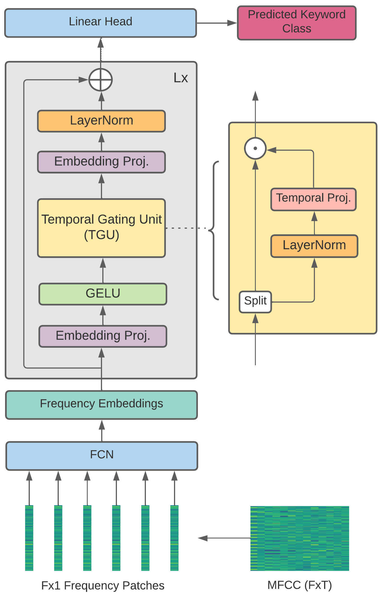

# Keyword-MLP

Official PyTorch implementation of [*Attention-Free Keyword Spotting*](https://arxiv.org/abs/2110.07749v1).



## Setup

```
pip install -r requirements.txt
```

## Dataset
To download the Google Speech Commands V2 dataset, you may run the provided bash script as below. This would download and extract the dataset to the "destination path" provided.

```
sh ./download_gspeech_v2.sh <destination_path>
```

## Training

The Speech Commands V2 dataset provides two files: `validation_list.txt` and `testing_list.txt`. Run:

```
python make_data_list.py -v <path/to/validation_list.txt> -t <path/to/testing_list.txt> -d <path/to/dataset/root> -o <output dir>
```

This will create the files `training_list.txt`, `validation_list.txt`, `testing_list.txt` and `label_map.json` at the specified output directory. 

Running `train.py` is fairly straightforward. Only a path to a config file is required. Inside the config file, you'll need to add the paths to the .txt files and the label_map.json file created above.

```
python train.py --conf path/to/config.yaml
```

Refer to the [example config](sample_configs/base_config.yaml) to see how the config file looks like, and see the [config explanation](docs/config_file_explained.md) for a complete rundown of the various config parameters.

## Inference

You can use the pre-trained model (or a model you trained) for inference, using the two scripts:

- `inference.py`: For short ~1s clips, like the audios in the Speech Commands dataset
- `window_inference.py`: For running inference on longer audio clips, where multiple keywords may be present. Runs inference on the audio in a sliding window manner.

```
python inference.py --conf sample_configs/base_config.yaml \
                    --ckpt <path to pretrained_model.ckpt> \
                    --inp <path to audio.wav / path to audio folder> \
                    --out <output directory> \
                    --lmap label_map.json \
                    --device cpu \
                    --batch_size 8   # should be possible to use much larger batches if necessary, like 128, 256, 512 etc.

!python window_inference.py --conf sample_configs/base_config.yaml \
                    --ckpt <path to pretrained_model.ckpt> \
                    --inp <path to audio.wav / path to audio folder> \
                    --out <output directory> \
                    --lmap label_map.json \
                    --device cpu \
                    --wlen 1 \
                    --stride 0.5 \
                    --thresh 0.85 \
                    --mode multi
```

## Weights & Biases

You can optionally log your training runs with [wandb](https://wandb.ai/site). You may provide a path to a file containing your API key, or use the `WANDB_API_KEY` env variable, or simply provide it manually from a login prompt when you start your training.

## Pretrained Checkpoints

| Model Name | Accuracy (V2-35) | Link |
| ---------- | ---------------- | ---- |
| KW-MLP     |       97.56      |  --  |